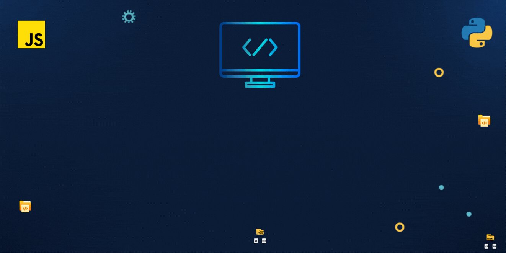

<p align="center">
  
</p>

<h2 align="center">Hello, World! 👋</h2>
  
```bash
$ whoami
Sil Developer
```

<p align="center">
  
</p>


<p align="center">
Desenvolvedora apaixonada por tecnologia, sistemas e projetos que conectam programação e pesquisa científica.
</p>


## 💻 Linguagens mais utilizadas

<p align="center">
  
</p>


## 🧰 Tecnologias e Ferramentas

<p align="center">


</p>


## 🌱 Atualmente estudando

- Modelagem Computacional  
- Arquitetura de Software  
- Automação e análise de dados  


## 🤝 Vamos nos conectar?

<p align="center">

[](https://www.linkedin.com/in/silvia-miguez123/)

</p>
